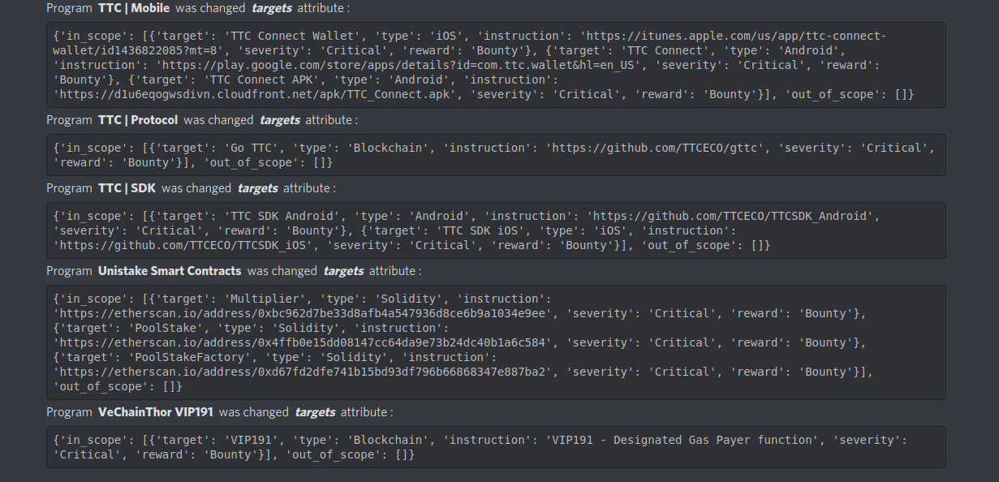

# Platforms-scopes

This repo notifies you of Changes to Bug Bounty Programs from Bugcrowd, Hackerone, Federacy, Hackenproof, Intigriti,
Yeswehack.

### Requirements

* python3.8 or higher
* pip3

### Installation

```shell
pip3 install -r requirements.txt
```

### Usage

1. Change `DISCORD_WEBHOOK` and Replace your Discord Webhook in `config.py`
( [Create Discord WebHook](https://support.discord.com/hc/en-us/articles/228383668-Intro-to-Webhooks) )
2. Run command ```crontab -e``` and add the following code to the end of it:
```
*/5 * * * * python3 /PROJECT-PATH/app.py 
```


### Description 
- After each run, the logs are saved in the `app.log` file
- Make sure the **Data** directory exists
- This script will take approximately 2~ seconds to run

### Sample of Result


### Will you help me?!
* If you want help me, You can complete the part of Sending Notification in Telegram and push it :)


### Get in touch
- [Telegram](https://t.me/ReymoRed)
- [instagram](https://ig.me/ReymoRed)
- [Twitter](https://twitter.com/ReymoRed)
- [GitHub](https://github.com/ReymoRed)
 
